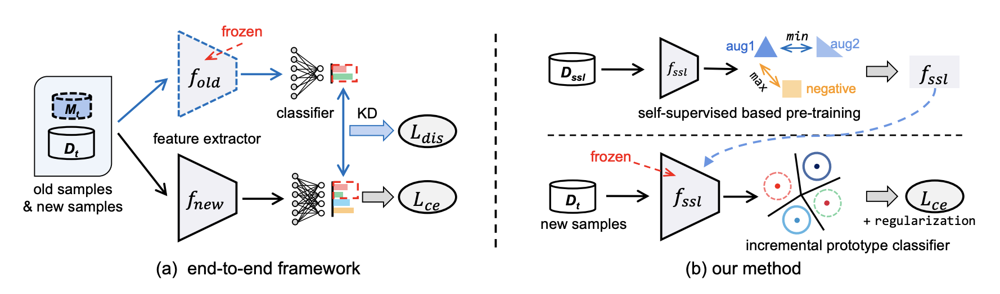

## IPC - Official PyTorch Implementation


### [Pattern Recognition 2025] Class incremental learning with self-supervised pre-training and prototype learning
Wenzhuo Liu, Xin-Jian Wu, Fei Zhu, Ming-Ming Yu, Chuang Wang, Cheng-Lin Liu<br>
[Paper](https://www.sciencedirect.com/science/article/pii/S0031320324006940)
### Usage 
We run the code with torch version: 1.10.0, python version: 3.8.0
* Installation
```
pip install -r requirements.txt
```
* Train CIFAR100
```
bash scripts/cifar100/byol.sh
```
* Train ImageNet100
```
bash scripts/imagenet100/byol.sh
```


### Citation 
```
@article{LIU2025110943,
title = {Class incremental learning with self-supervised pre-training and prototype learning},
journal = {Pattern Recognition},
volume = {157},
pages = {110943},
year = {2025}
}
```

### Reference
Our implementation references the codes in the following repositories:
* <https://github.com/DRSAD/iCaRL>
* <https://github.com/vturrisi/solo-learn>

### Contact
Wenzhuo Liu (liuwenzhuo2020@ia.ac.cn)
